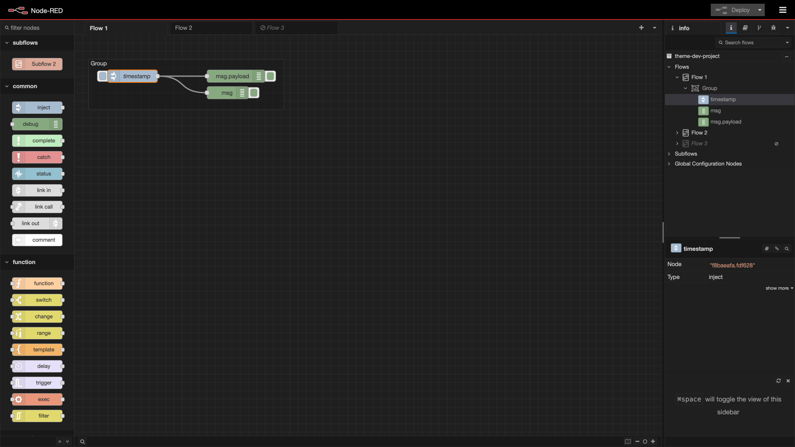
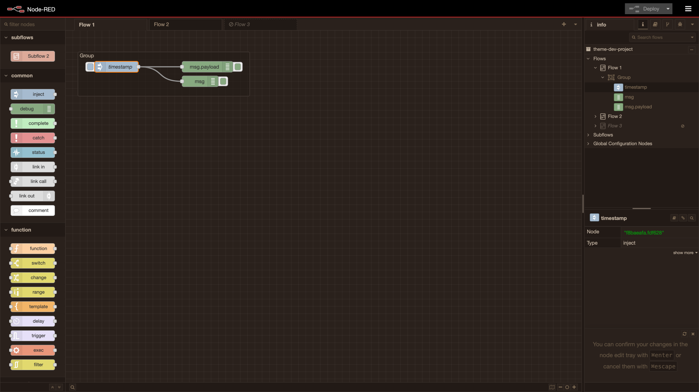
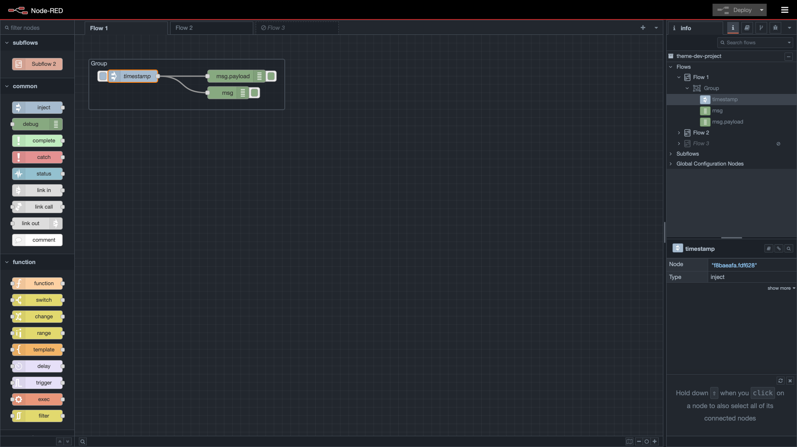
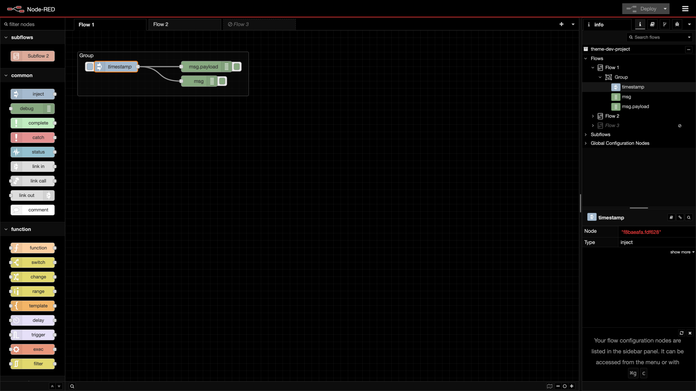
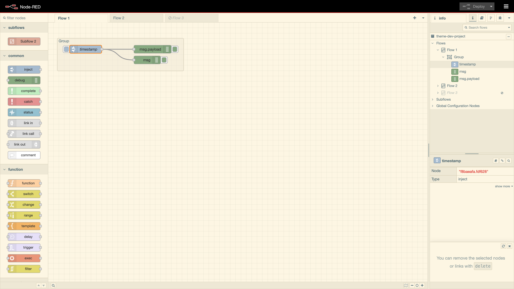
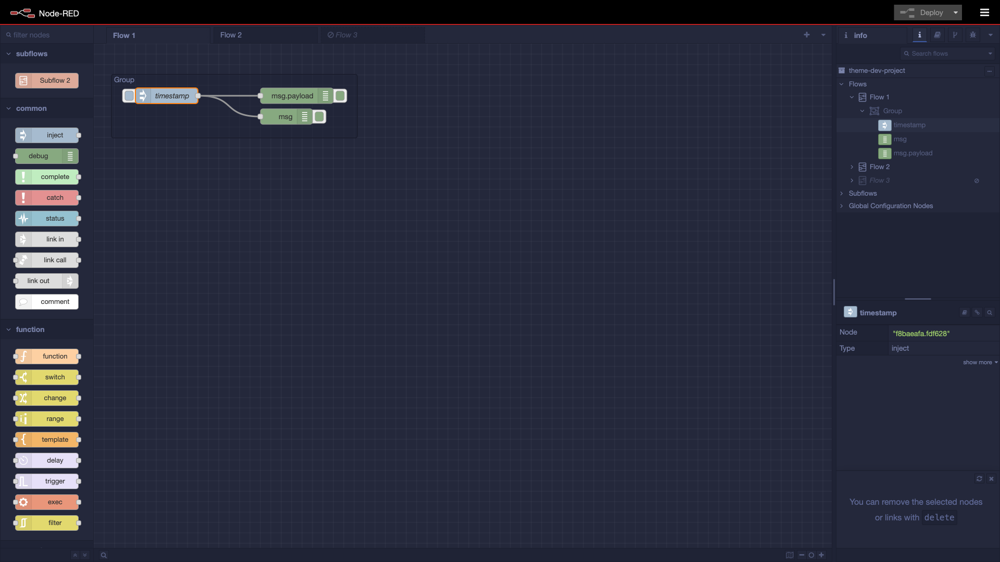
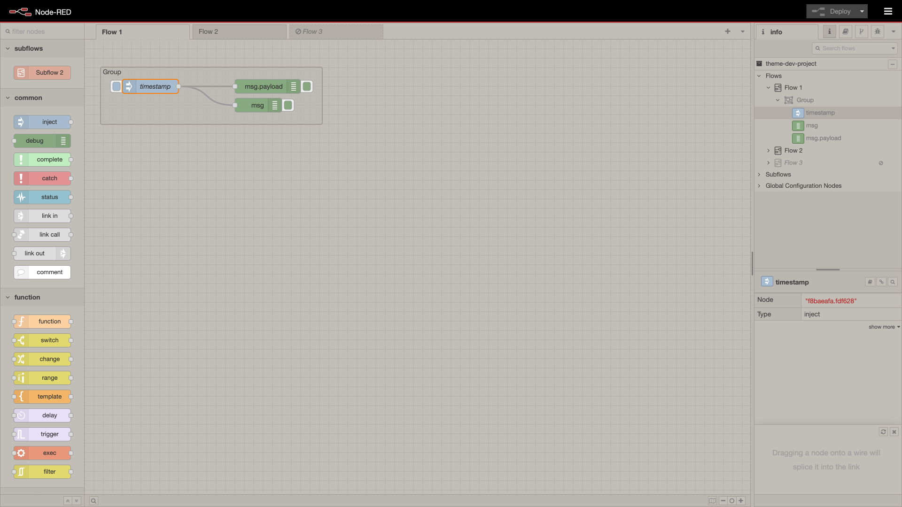

# Screenshots

## Table of Contents

- [aurora](#aurora)
- [cobalt2](#cobalt2)
- [dark](#dark)
- [dracula](#dracula)
- [espresso-libre](#espresso-libre)
- [github-dark](#github-dark)
- [github-dark-default](#github-dark-default)
- [github-dark-dimmed](#github-dark-dimmed)
- [midnight-red](#midnight-red)
- [monoindustrial](#monoindustrial)
- [monokai](#monokai)
- [monokai-dimmed](#monokai-dimmed)
- [noctis](#noctis)
- [oceanic-next](#oceanic-next)
- [oled](#oled)
- [one-dark-pro](#one-dark-pro)
- [one-dark-pro-darker](#one-dark-pro-darker)
- [solarized-dark](#solarized-dark)
- [solarized-light](#solarized-light)
- [tokyo-night](#tokyo-night)
- [tokyo-night-light](#tokyo-night-light)
- [tokyo-night-storm](#tokyo-night-storm)
- [totallyinformation](#totallyinformation)
- [zenburn](#zenburn)

## aurora

## cobalt2

## dark

## dracula

## espresso-libre

## github-dark

## github-dark-default

## github-dark-dimmed

## midnight-red

## monoindustrial

## monokai

## monokai-dimmed

## noctis

## oceanic-next

## oled

## one-dark-pro

## one-dark-pro-darker

## solarized-dark

## solarized-light

## tokyo-night

## tokyo-night-light

## tokyo-night-storm

## totallyinformation

## zenburn

